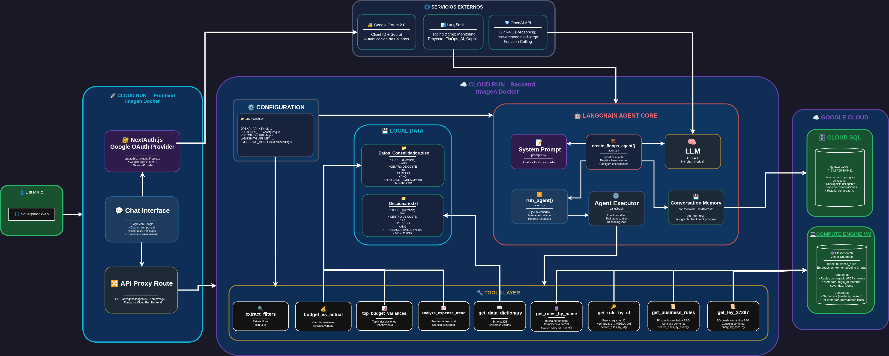

# 🤖 FinOps AI

Un agente de inteligencia artificial conversacional diseñado para analizar datos financieros de proyectos (FinOps), responder consultas sobre presupuesto vs. ejecución, variaciones de gasto y normativa legal peruana (Ley 27287 – Títulos de Valores). El sistema está compuesto por un **backend** expuesto como API REST y un **frontend** web con autenticación Google, ambos desplegados en **Google Cloud Run**.

## 🎥 Demo en video

Haz clic en la imagen para ver el video en YouTube:

<p align="center">
  <a href="https://youtu.be/Vf3wiZjVEfc">
    
  </a>
</p>

---

## 📐 Arquitectura General


---

## 🛠️ Stack Tecnológico

### Backend (`backend/`)

| Categoría | Tecnología |
|-----------|-----------|
| Lenguaje | Python 3.9 |
| Servidor | Flask + Gunicorn |
| Framework de Agente | LangChain + LangGraph |
| Modelo LLM | OpenAI GPT-4.1 |
| Memoria conversacional | LangGraph Checkpoint Postgres |
| Base de datos de memoria | PostgreSQL (Cloud SQL) |
| RAG financiero | LangChain Elasticsearch |
| RAG legal (Ley 27287) | LlamaIndex + Elasticsearch Vector Store |
| Embeddings | OpenAI `text-embedding-*` |
| Monitoreo de agente | LangSmith |
| Procesamiento de datos | Pandas + OpenPyXL |
| Contenedor | Docker (python:3.9) |
| Despliegue | Google Cloud Run |

### Frontend (`frontend/`)

| Categoría | Tecnología |
|-----------|-----------|
| Framework | Next.js 15 (App Router) |
| Lenguaje | TypeScript |
| Autenticación | NextAuth.js v4 (Google OAuth 2.0) |
| Estilos | Tailwind CSS v4 |
| Runtime | Node.js |
| Contenedor | Docker (Node multi-stage) |
| Despliegue | Google Cloud Run |

---

## 📁 Estructura del Código

```
Proyecto/
├── README.md                          ← Este archivo
│
├── backend/                           ← Backend (API REST del agente)
│   ├── Dockerfile                     ← Imagen Docker con Python 3.9 + Gunicorn
│   ├── main.py                        ← Entry point: Flask app + endpoints
│   ├── requirements.txt               ← Dependencias Python
│   ├── .env                           ← Variables de entorno (no versionar)
│   ├── .dockerignore
│   ├── .gitignore
│   ├── data/                          ← Archivos Excel con datos financieros
│   └── src/
│       ├── agent/
│       │   ├── agent.py               ← Creación y ejecución del agente LangChain
│       │   └── prompts.py             ← System prompt del agente FinOps
│       ├── tools/
│       │   └── financial_tools.py     ← Herramientas del agente:
│       │                                  · budget_vs_actual
│       │                                  · top_budget_variances
│       │                                  · analyze_expense_trend
│       │                                  · get_business_rules / get_rule_by_id
│       │                                  · get_data_dictionary
│       │                                  · extract_filters
│       │                                  · query_ley_27287 (RAG legal)
│       ├── memory/
│       │   └── conversation_memory.py ← Configuración de PostgresSaver (checkpoints)
│       ├── legal/
│       │   └── legal_rag.py           ← Conexión RAG a Elasticsearch (Ley 27287)
│       └── rules/                     ← Reglas de negocio (YAML)
│
└── frontend/                          ← Frontend (interfaz web del chat)
    ├── Dockerfile                     ← Imagen Docker multi-stage (Node.js)
    ├── package.json                   ← Dependencias Node.js
    ├── next.config.ts                 ← Configuración Next.js
    ├── tailwind.config.js             ← Configuración Tailwind CSS
    ├── .dockerignore
    └── src/
        └── app/
            ├── layout.tsx             ← Layout raíz con AuthProvider
            ├── page.tsx               ← Página principal: interfaz de chat
            ├── globals.css            ← Estilos globales
            ├── AuthProvider.tsx       ← Proveedor de sesión NextAuth
            └── api/
                └── auth/
                    └── [...nextauth]/ ← Configuración de rutas OAuth (Google)
```

> [!NOTE]
> 📊 Los datos usados en los archivos Excel (`data/`) son **ficticios y creados manualmente** con fines académicos y demostrativos. No representan información financiera real.

---

## ☁️ Despliegue en Google Cloud Run

> **Pre-requisitos:**
> - Tener instalado y autenticado `gcloud CLI`
> - Tener habilitadas las APIs: Cloud Build, Cloud Run, Artifact Registry
> - El proyecto GCP configurado

---

### 🔧 Backend

> [!IMPORTANT]
> **Antes de desplegar el backend**, asegúrate de que los siguientes servicios de infraestructura ya estén activos y accesibles:
>
> - ✅ **PostgreSQL (Cloud SQL):** La base de datos debe estar creada y en ejecución. El backend la usa para almacenar la memoria conversacional del agente (checkpoints de LangGraph). Verifica que el `DATABASE_URL` del archivo `.env` sea correcto y que la instancia permita conexiones desde Cloud Run.
>
> - ✅ **Elasticsearch (VM vectorial):** El servidor de Elasticsearch debe estar en ejecución con los índices vectoriales ya cargados. El backend lo usa para el RAG financiero y la consulta de la Ley 27287. Verifica que `ELASTICSEARCH_URL` y `ELASTICSEARCH_API_KEY` estén configurados correctamente en el `.env`.

#### 1. Construir la imagen Docker

Desde la carpeta `backend/`, ejecutar:

```bash
gcloud builds submit --tag us-west2-docker.pkg.dev/{id proyecto}/finops/imagen_backend:latest
```

#### 2. Desplegar el microservicio en Cloud Run

```bash
gcloud run deploy backendemo \
  --image us-west2-docker.pkg.dev/{id proyecto}/finops/imagen_backend:latest \
  --region us-west4 \
  --allow-unauthenticated
```

> ⚠️ Asegúrate de configurar las variables de entorno del backend (claves de OpenAI, PostgreSQL, Elasticsearch, LangSmith) a través de la consola de Cloud Run o usando `--set-env-vars` / `--set-secrets`.

---

### 🎨 Frontend

> [!IMPORTANT]
> **Antes de construir la imagen del frontend**, actualiza la URL del backend en el archivo proxy del frontend:
>
> Abre el archivo `frontend/src/app/api/agent/route.ts` y reemplaza la URL del backend con la URL real del servicio `backendemo` desplegado en Cloud Run:
>
> ```typescript
> // frontend/src/app/api/agent/route.ts
> const url = `https://<URL_DEL_BACKEND_EN_CLOUD_RUN>/agent?` +
>   new URL(request.url).searchParams.toString();
> ```
>
> ⚠️ Si no actualizas esta URL, el frontend no podrá comunicarse con el agente.

#### 1. Construir la imagen Docker

Desde la carpeta `frontend/`, ejecutar:

```bash
gcloud builds submit --tag us-west2-docker.pkg.dev/{id proyecto}/finops/imagen_frontend:latest
```

#### 2. Desplegar el microservicio en Cloud Run

```bash
gcloud run deploy frontdemo \
  --image us-west2-docker.pkg.dev/{id proyecto}/finops/imagen_frontend:latest \
  --region us-west4 \
  --allow-unauthenticated \
  --port 8080
```

#### 3. Configurar variables de entorno de autenticación

```bash
gcloud run services update frontdemo \
  --region us-west4 \
  --update-env-vars="GOOGLE_CLIENT_ID={GOOGLE_CLIENT_ID},GOOGLE_CLIENT_SECRET={GOOGLE_CLIENT_SECRET},NEXTAUTH_SECRET={NEXTAUTH_SECRET}"
```

#### 4. Configurar la URL pública de NextAuth

Una vez desplegado el servicio, actualizar la variable `NEXTAUTH_URL` con la URL real asignada:

```bash
gcloud run services update frontdemo \
  --region us-west4 \
  --update-env-vars="NEXTAUTH_URL={URL_FRONTEND}"
```

---

## 🧪 Cómo Probar el Agente

### Opción 1: Interfaz Web (Frontend)

1. Abrir la URL del frontend desplegado en Cloud Run
2. Iniciar sesión con tu cuenta de Google (OAuth 2.0).
3. Escribir una pregunta en el campo de texto y presionar **Enviar**.
4. El agente responderá con un efecto de escritura progresiva (typewriter).

---

### Opción 2: API REST del Backend (directo)

El backend expone un único endpoint `GET /agent`. Puedes probarlo con `curl` o desde el navegador:

#### Ejemplo con `curl`:

```bash
curl "https://<URL_BACKEND>/agent?msg=¿Cuál es el presupuesto vs ejecución de la torre Lima?&idagente=usuario_01"
```

#### Parámetros del endpoint:

| Parámetro | Tipo | Requerido | Descripción |
|-----------|------|-----------|-------------|
| `msg`     | string | ✅ Sí | Consulta o pregunta al agente |
| `idagente`| string | ❌ No | ID del hilo de conversación (mantiene contexto). Default: `"default"` |

#### Respuesta esperada (JSON):

```json
{
  "response": "El presupuesto para la Torre Lima es de S/ 1,200,000 con una ejecución del 87%...",
  "thread_id": "usuario_01"
}
```

#### Health check:

```bash
curl "https://<URL_BACKEND>/"
# {"status": "ok", "service": "FinOps AI Copilot"}
```

---

### Opción 3: CLI Interactiva (modo local)

Para ejecutar el agente en modo conversacional directamente desde la terminal:

```bash
cd FinsOps_AI_Agent_v1
python main.py --cli
```

---

### 💬 Ejemplos de Consultas al Agente

| Tipo de consulta | Ejemplo |
|-----------------|---------|
| Presupuesto vs ejecución | `"¿Cuál es el presupuesto vs ejecución de la gerencia 1?"` |
| Variaciones de gasto | `"Muéstrame las 5 mayores variaciones de presupuesto del país Colombia"` |
| Tendencia de gastos | `"¿Cómo ha evolucionado el gasto del proyecto XYZ en los últimos meses?"` |
| Consulta legal | `"¿Qué establece la Ley 27287 sobre el endoso de una letra de cambio?"` |
| Reglas de negocio | `"¿Cuáles son las reglas de aprobación de gastos?"` |
| Diccionario de datos | `"¿Qué significa el campo 'centro de costos'?"` |

---

## 🔑 Variables de Entorno

### Backend (`.env` en `backend/`)

| Variable | Descripción |
|----------|-------------|
| `OPENAI_API_KEY` | Clave de la API de OpenAI |
| `LANGCHAIN_API_KEY` | Clave de LangSmith (opcional, para monitoreo) |
| `LANGCHAIN_PROJECT` | Nombre del proyecto en LangSmith |
| `DATABASE_URL` | Cadena de conexión PostgreSQL (Cloud SQL) |
| `ELASTICSEARCH_URL` | URL del servidor Elasticsearch |
| `ELASTICSEARCH_API_KEY` | API Key de Elasticsearch |

### Frontend (Cloud Run env vars)

| Variable | Descripción |
|----------|-------------|
| `GOOGLE_CLIENT_ID` | Client ID de OAuth 2.0 de Google |
| `GOOGLE_CLIENT_SECRET` | Client Secret de OAuth 2.0 de Google |
| `NEXTAUTH_SECRET` | Secreto para firmar tokens de NextAuth |
| `NEXTAUTH_URL` | URL pública del servicio de frontend |
| `NEXT_PUBLIC_API_URL` | URL del backend (para las llamadas al agente) |

---

## 📄 Licencia

Este proyecto es parte de un trabajo académico de la **Especialización en Inteligencia Artificial**.
